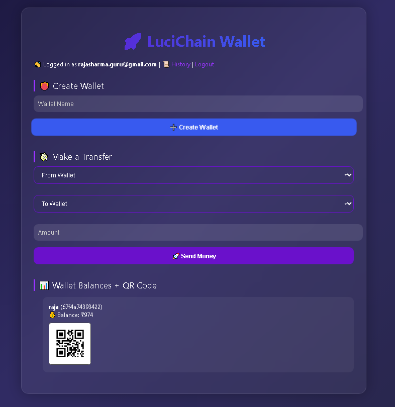
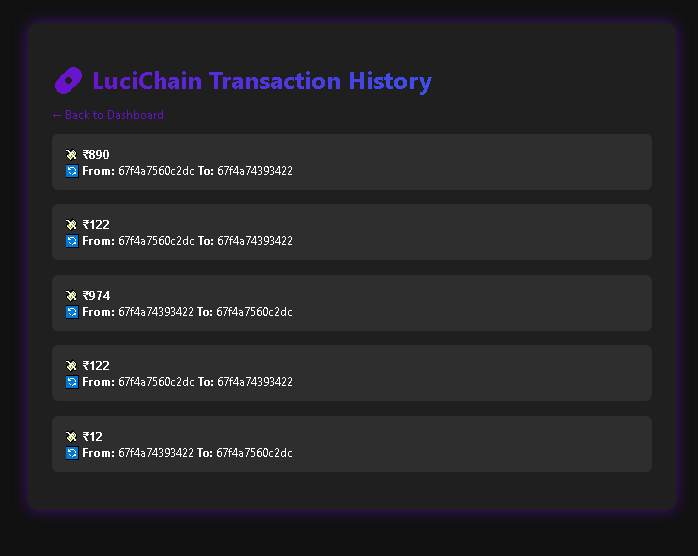

# 🚀 LuciChain – Decentralized PHP Payment System with Blockchain

> 💸 A fully decentralized and animated PHP-based payment platform with blockchain, QR code wallets, wallet hashing, login authentication, and secure money transfer. 🔐

---

## 🙏 Support the Project

Love LuciChain? Help me keep it alive & growing! Your support means everything. ❤️

> 🟢 **UPI**: `gamobhai2@ybl`  
> 🧾 **Binance UID**: `783008968`

### 💰 Crypto Donations

| Coin | Address |
|------|---------|
| **USDT (TRC-20)** | `TXKPBgR9d5xq5KpAyd2maPVQuEEDZ9DgiQ` |
| **BTC** | `1JeBUw4bjL9tuKrHwKKk4dx3mPy1jxys8j` |
| **LTC** | `LPUR2CE5SfArfYRJWkdtqhGz3t17Rijz2d` |

---

## 🧠 Upcoming Features

- 🔐 OTP-based login using custom blockchain logic
- 🧬 Face verification before payment
- 🔒 PIN login system
- ☁️ Firebase-based hash storage for tamper-proof transactions
- 📈 Blockchain Explorer Page
- 🌐 Full decentralization upgrades
- 🌙 Dark Mode + Mobile Responsiveness
- 🚀 And many more updates coming soon...

> 🔔 **Stay tuned** for new updates every week!

---

## ✨ Features

- 👤 Secure user registration & login
- 👛 Wallet creation (requires login)
- 💸 Peer-to-peer money transfers
- 🔗 Blockchain integration with SHA-256 hashing
- 📄 Transaction history with tamper protection
- 📊 Live wallet balances
- 🧾 QR code for every wallet (auto-generated)
- 🎨 Beautiful UI with modern CSS animations

---

## 💻 Built With

- 🧠 **Core Language:** PHP (server-side)
- 📦 **Blockchain:** Custom implementation (JSON-based)
- 🖼️ **UI:** HTML5, CSS3 (with animations)
- 🧾 **QR Codes:** PHP QR Code Library
- 🗂️ **Database:** JSON files (lightweight, no MySQL needed)

---

## 🖼️ UI Preview

Here’s how LuciChain looks in action:

### 🔐 Login Panel


### 💼 Dashboard


### 💸 Wallet History


### 📊 QR Wallets


> You can add more screenshots anytime to this section.

---

## ⚙️ How to Run Locally

1. 📥 Clone the repo:
```bash
git clone https://github.com/yourusername/LuciChain.git
cd LuciChain
